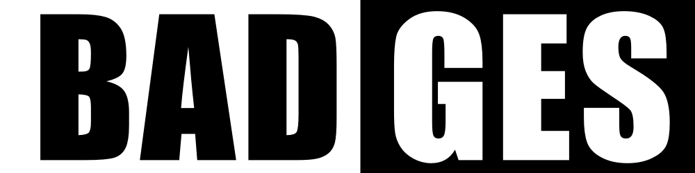

    </img>
    <h6 align="center">Simple badges for your next project</h6>

## Examples

|                 Go                 | JavaScript | Libraries | Python | Rust |
|------------------------------------|------------|-----------|--------|------|
|  </img>  |  </img>  |  </img>  |  </img>  |  </img>  |
|  </img>  |  </img>  |  </img>  |  </img>  |  </img>  |
|  </img>  |  </img>  |  </img>  |  </img>  |  </img>  |
|  </img>  |  </img>  |  </img>  |  </img>|  </img>  |